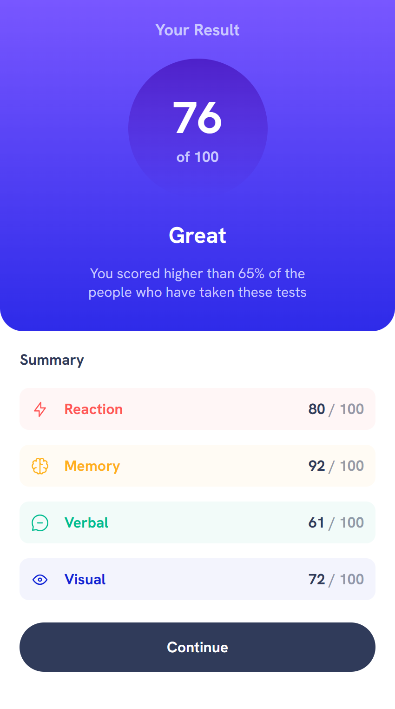
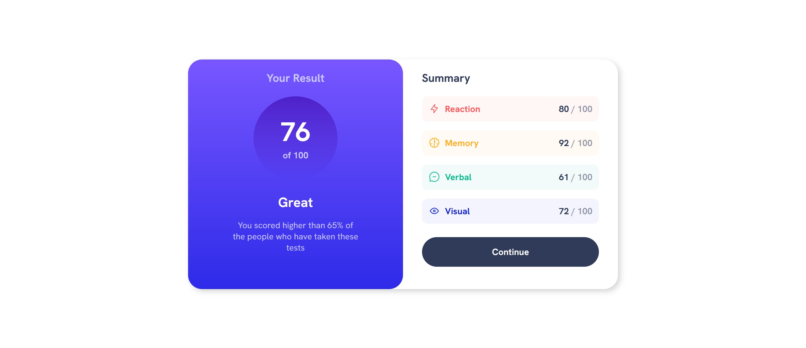

# Frontend Mentor - Results summary component solution

This is a solution to the [Results summary component challenge on Frontend Mentor](https://www.frontendmentor.io/challenges/results-summary-component-CE_K6s0maV). Frontend Mentor challenges help you improve your coding skills by building realistic projects. 

## Table of contents

- [Overview](#overview)
  - [The challenge](#the-challenge)
  - [Screenshot](#screenshot)
  - [Links](#links)
- [My process](#my-process)
  - [Built with](#built-with)
  - [What I learned](#what-i-learned)
- [Author](#author)

## Overview

### The challenge

Users should be able to:

- View the optimal layout for the interface depending on their device's screen size
- See hover and focus states for all interactive elements on the page
- **Bonus**: Use the local JSON data to dynamically populate the content

### Screenshot

Mobile

Desktop

### Links

- [Solution URL](https://github.com/jcnevess/results-summary)
- [Live Site URL](https://jcnevess.github.io/results-summary)

## My process

### Built with

- CSS custom properties
- Flexbox
- CSS Grid
- Mobile-first workflow
- **Web components**

### What I learned

As a challenge, I used `web components` to tackle the creation of each section of the summary. It was hard...

I think Web components are a very powerful tool, but the module feels like a work in progress. It is a bit hard to do simple tasks using it, and it seems very error prone too. Maybe things would be easier if I used web components with templates. Well, I learnt something new. 

## Author

- Website - [Júlio Neves](https://jcnevess.github.io/)
- Frontend Mentor - [@jcnevess](https://www.frontendmentor.io/profile/jcnevess)
